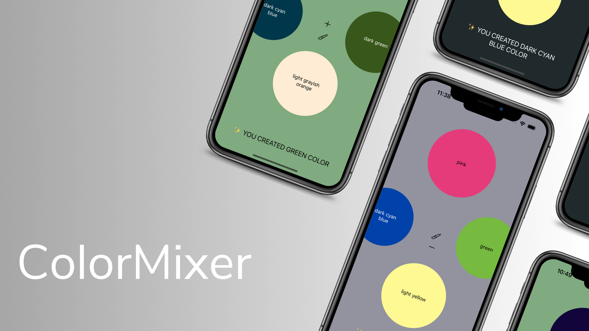

# ColorMixer

    

  
 

  
##
**ColorMixer** is a mobile application for mixing colors. You can choose up to 4 colors. 

## Key Features:

- **MVC Architecture**
- **Layout by code**
- **ColorPicker**
- **Animation**
- **Color of the text adjusts dependiong on the dark or bright colors**

